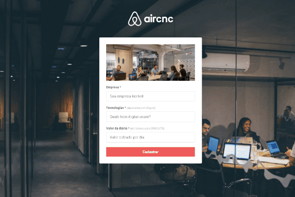
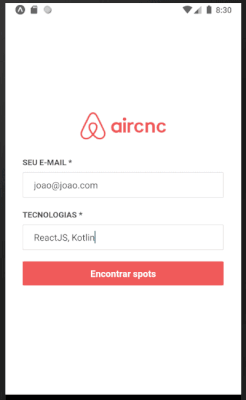

<h1 align="center">
    
</h1>

<h4 align="center">
  ☕ Code and coffee
</h4>

<p align="center">
  

  
  
  <a href="https://github.com/Rocketseat/semana-omnistack-9/commits/master">
    
  </a>

  <a href="https://github.com/Rocketseat/semana-omnistack-9/issues">
    
  </a>

  
</p>

<p align="center">
  <a href="#rocket-tecnologias">Tecnologias</a>&nbsp;&nbsp;&nbsp;|&nbsp;&nbsp;&nbsp;
  <a href="#-projeto">Projeto</a>&nbsp;&nbsp;&nbsp;|&nbsp;&nbsp;&nbsp;
  <a href="#-layout">Layout</a>&nbsp;&nbsp;&nbsp;|&nbsp;&nbsp;&nbsp;  
  <a href="#running">Running</a>&nbsp;&nbsp;&nbsp;|&nbsp;&nbsp;&nbsp;  
</p>

<p >
  
  
</p>

## :rocket: Technologies

This project was developed with the following technologies:

- [Node.js](https://nodejs.org/en/)
- [React](https://reactjs.org)
- [React Native](https://facebook.github.io/react-native/)
- [Expo](https://expo.io/)

## 💻 Projeto

The Aircnc is a project to connect companies that want to rent spots and developers who are looking for proffesionals to interact with, get in touch with tech companies and/or get a part time job.

## 🔖 Layout

You can download the project's layout (`.sketch`) on [this link](https://rocketseat-cdn.s3-sa-east-1.amazonaws.com/semana-omnistack/aircnc.sketch).

To open the file, on any O.S. use the tool [Zeplin](https://zeplin.io).

## Running

To run the backend

```shell
$ yarn run dev
```

To run the web application

```shell
$ yarn start
```

To run the mobile application

```shell
$ yarn start
```
